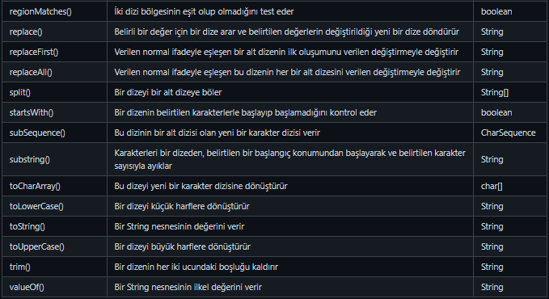

# Math Sınıfı

Default olarak gelir import etmemize gerek yok.

Math sınıfına ait metotlar statik oldukları için
nesne üretilmeden çağırılabilirler.

## Sık kullanılan Math metotları

| Metot    | Açıklaması                         |     Geri Dönüş Tipi      |
|:---------|:-----------------------------------|:------------------------:|
| abs(x)   | x'in mutlak değerini verir         | double, float, int, long |
| ceil(x)  | En yakın üst sayıya yuvarlar.      |          double          |
| floor(x) | En yakın alt sayıya yuvarlar.      |          double          |
| pow(x,y) | x^y sonucunu bulur.(2 üssü 3)      |          double          |
| random() | 0-1 arasında rastgele sayı üretir. |          double          |
| round(x) | En yakın sayıya yuvarlar.          |           int            |

---

# String Sınıfı

Math sınıfının aksine metotlar statik olmadığı için String sınıfına ait
bir nesne oluşturulup metotlara erişilebilir.

```java
String str=new String("Hello"); //Bu sekilde str nesnesi olusturduk ve degeri "Hello";
String str2="Hello2"; //Alisilmis bir diger yolu 
```




---

# Pratikler

## *Pratik 1* - Sayı Tahmin Oyunu

0-100 arasında rastgele seçilen bir sayıyı kullanıcının tahmin etmesini sağlayın.

Özellikler:
* Yanlış değer 1'den fazla girilirse o zaman tahmin hakkı azalacak.
* Yanlış girilenler kullanıcıya gösterilecek

---

## *Pratik 2* - Palindromik Kelimleri Bulan Program

Eğer bir kelimenin tersten okunuşu yine aynı kelime ise o kelime **Palindromik kelimedir.**

---


